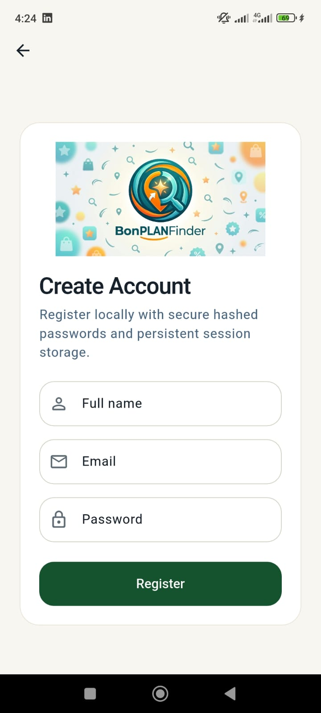
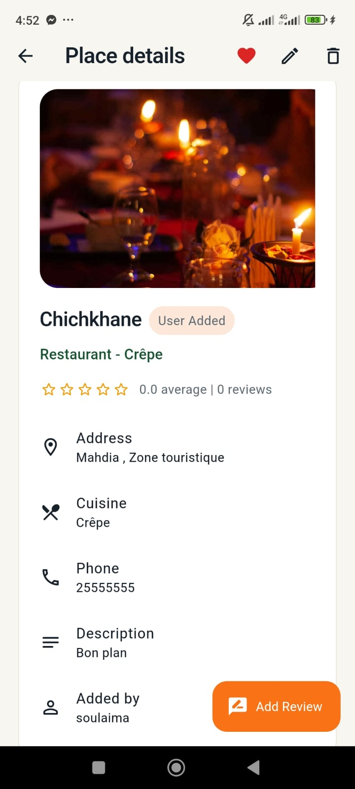
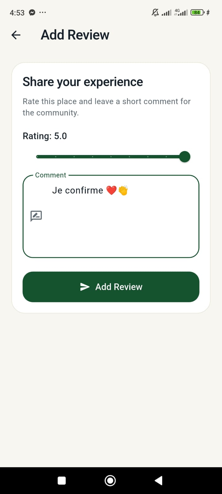

# BonPlanFinder
### Flutter mobile app for discovering nearby restaurants and cafés with community recommendations


---

## 🚀 Quick Summary

BonPlanFinder is a Flutter mobile application that helps users discover nearby restaurants and cafés using GPS, community recommendations, and local offline storage.

The app is designed for students, travelers, and locals who want fast and reliable food recommendations in one place.

---

## 🎯 Project Goal

The goal of BonPlanFinder is to simulate a real-world mobile application that helps users discover nearby restaurants and cafés using location-based services and offline-first architecture.

---

## 📌 Project Overview

BonPlanFinder allows users to:

- Discover nearby restaurants and cafés using GPS
- Explore places using smart search filters
- Add and share community places
- Save favorites and manage personalized lists
- Write and manage reviews and ratings
- Use the app offline with local database support

It uses a **local-first architecture** with SQLite and integrates OpenStreetMap data for real-world location discovery.

---

## ✨ Features

- 📍 Nearby restaurant & café discovery (GPS + OpenStreetMap)
- 🔎 Smart search (name, type, cuisine, address)
- ➕ Add community places with images
- ✏️ Edit and delete user-created places
- ⭐ Favorites system
- 📝 Reviews and ratings system
- 👤 User profile management
- 🔐 Local authentication with hashed passwords
- 📱 Offline support using SQLite
- ⚠️ Error handling for no internet or GPS access

---

## 🛠 Tech Stack

- **Flutter** → Cross-platform mobile UI
- **Dart** → App logic
- **Provider** → State management
- **SQLite (sqflite)** → Local database
- **SharedPreferences** → Session storage
- **HTTP** → API requests
- **OpenStreetMap / Overpass API** → Location data
- **Geolocator** → GPS location
- **Image Picker** → Image upload
- **Crypto (SHA-256)** → Password hashing
- **intl** → Date formatting

---

## ⚡ Technical Highlights

- Offline-first architecture using SQLite
- Real-time GPS-based place discovery
- Secure authentication with SHA-256 hashing
- Clean state management using Provider
- API integration with OpenStreetMap

---

## 🧱 Architecture

```text
Presentation Layer (UI - screens/widgets)
        ↓
State Management (Provider)
        ↓
Service Layer (business logic)
        ↓
Data Layer (SQLite + OpenStreetMap API)
````

### Architecture Explanation

* **UI Layer** → Handles screens and widgets
* **Provider Layer** → Manages state and updates UI
* **Service Layer** → Handles authentication, places, reviews, and logic
* **Data Layer** → SQLite for local storage + OpenStreetMap for external data

---

## 📸 Screenshots


| Login                              | Details                                      | Reviews                                  |
| ---------------------------------- | -------------------------------------------- | ---------------------------------------- |
|  |  |  |

---

## 🚀 Installation & Setup

### 1. Clone repository

```bash
git clone https://github.com/your-username/bonplanfinder.git
cd bonplanfinder
```

### 2. Install dependencies

```bash
flutter pub get
```

### 3. Run application

```bash
flutter run
```

### Run on specific device

```bash
flutter run -d android
flutter run -d ios
```

---

## 📁 Project Structure

```text
lib/
├── models/
├── providers/
├── screens/
├── services/
├── widgets/
├── utils/
└── main.dart
```

---

## 🔐 Authentication System

* Local user registration and login
* Passwords secured using SHA-256 hashing
* Session persistence using SharedPreferences
* Offline-first authentication system

---

## 🌍 Key Functionalities

* GPS-based nearby search
* Community-driven restaurant sharing
* Favorites & review system
* Offline data storage
* Profile customization
* Error handling for network/GPS issues

---

## 💡 Why this project

This project demonstrates real-world Flutter development skills including:

* State management (Provider)
* Local database integration (SQLite)
* API integration (OpenStreetMap)
* Authentication system
* Mobile UI/UX design
* Offline-first architecture

---

## 🔮 Future Improvements

* Firebase integration (cloud sync)
* Google Maps integration
* Push notifications
* Real-time chat for recommendations
* Advanced filtering system

---

## 👤 Author

**Hiba Maatoug**
Flutter Developer | Mobile & UI Enthusiast

---

## 📄 License

This project is licensed under the MIT License.

```

